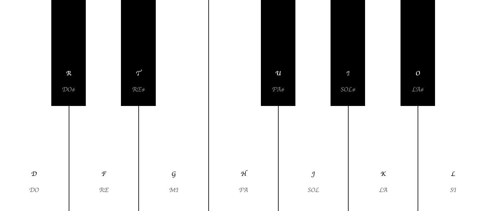

# PIANO KIT

## About

A "Piano Kit" is a simple piano board containing the essential keys. Each of them is represented by an equivalent key in the keyboard, which allows the user to play some piano sounds.

The list of keys and matching sounds:
- D => DO

- F => RE

- G => MI

- H => FA

- J => SOL

- K => LA

- L => SI

- R => DO#

- T => RE#

- U => FA#

- I  => SOL#

- O => LA#

A screenshot of the Piano kit is presented below:



## Built With

- HTML, CSS, Javascript.
- VisualStudio Code, Git, & GitHub.
## Author

👤 **Maha Magdy**

- GitHub: [Maha-Magdy](https://github.com/Maha-Magdy)
- Twitter: [@Maha_M_Abdelaal](https://twitter.com/Maha_M_Abdelaal)
- LinkedIn: [Maha Magdy](https://www.linkedin.com/in/maha-magdy-abdelaal/)

## 🤝 Contributing

Contributions, issues, and feature requests are welcome!

Feel free to check the [issues page](https://github.com/Maha-Magdy/piano-kit/issues).

## Acknowledgments

- Sound Effects from <a href="https://pixabay.com/?utm_source=link-attribution&amp;utm_medium=referral&amp;utm_campaign=music&amp;utm_content=101774">Pixabay</a>

## 📝 License

This project is [MIT](./LICENSE) licensed.

<!-- 
  
This application was built with React.
## Built With

- HTML, CSS, TypeScript.
- React.
- VisualStudio Code, Git, & GitHub.
## Pre-requisites

- NodeJs
- Git
## Getting Started

To run this project, you only need a computer with a browser installed, and follow these steps:


1. In your terminal, in the folder of your preference, type the following bash command to clone this repository:

```sh
git clone git@github.com:Maha-Magdy/score-visualization.git
```

2. Now that you have already cloned the repo run the following commands to get the project up and running:
```sh
cd score-visualization
npm install
npm start
```

3. To change the name of the animal, and its BMI score to see the difference in the UI go to 
```sh
src/App.tsx
```
and change the value of the props name, and bmiScore that belong to ScoreVisualization component then save.


## 🤝 Contributing

Contributions, issues, and feature requests are welcome!

Feel free to check the [issues page](https://github.com/Maha-Magdy/score-visualization/issues).

## Show your support

Give a ⭐️ if you like this project!

 -->
